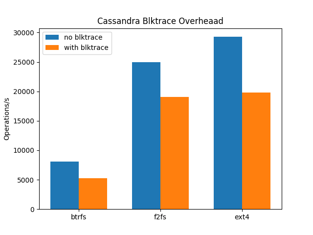
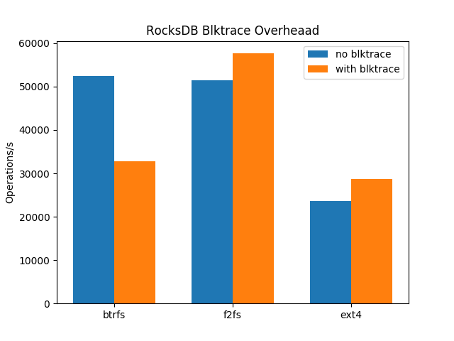

# Workload Analysis

## Introduction

Database systems and file systems are both designed and optimized for some specific use case. The choice of the database system as well as the file system will have an impact on overall performance. As the adoption rates of SSDs grow over time, conventional wisdom from HDDs will become outdated as database systems and file systems are redesigned with the characteristics of SSDs in mind.

We present an analysis of the use of some modern database systems on a variety of file systems. More specifically, we will be looking at two different database systems: [Cassandra](https://cassandra.apache.org) and [RocksDB](https://rocksdb.org). We will be examining them running on three different file systems: [ext4](https://ext4.wiki.kernel.org/index.php/Main_Page), [f2fs](https://f2fs.wiki.kernel.org/start), and [btrfs](https://btrfs.wiki.kernel.org/index.php/Main_Page). In this analysis, we examine the block access patterns and performance for each of the configurations as well as look at the overhead added by `blktrace`

## Cassandra

[Cassandra](https://cassandra.apache.org) is a modern NoSQL database with high availability in mind. Through the use of data replication that spans across a cluster of nodes, it has no single point of failure. Cassandra operates under a client-server architecture where the server operating across multiple nodes and several client applications performing reads and writes to the server. For our purposes, we will only examine a single node cluster with multiple clients, thus we will not benefit from the replication capabilities of Cassandra.

## RocksDB

[RocksDB](https://rocksdb.org) is an embedded key value store that has been optimized for flash storage. Its use of a Log-Structured-Merged-Database (LSM) provides flexible tradeoffs between read/write/space amplication factors. Due to its embedded nature, the benchmark as well as RocksDB itself will be run on the same machine.

## YCSB

[YCSB](https://github.com/brianfrankcooper/YCSB) is the tool we shall be using to generate a workload. This workload is done in two stages: load and run. The loading stage is where we will populate the database with our initial data against which we will run a workload and measure any desired metrics. The running stage is where the actual work is done such as fetching data from the database as well as writing new data to the database.

## Methodology

### Overview

#### Cassandra

For `Cassandra`, we need one server machine and one client machine as well as a total of three drives are needed (more server and client machines can be added to take advantage of the replication capabilities of `Cassandra` and access the data through multiple clients). One for the data, one for the metadata, and one for `blktrace`. The data directory will contain only the data from `Cassandra`. The metadata will include the hints, commit log, saved caches and logs from `Cassandra`. The `blktrace` will just be the output of the `blktrace` command, with one file for each cpu core. Once the drives are ready:

On the server machine:

1. Format two drives with the same file system, one of `btrfs`, `f2fs`, and `ext4`. One for the data and one for the metadata.

2. Format the last drive as `ext4` for `blktrace`.

3. Mount all three drives, and change ownership so it can be written to without super user priviledges.

4. Configure `Cassandra` to write to the mounted drives.

5. Start up `Cassandra`.

6. Set up the keyspaces using `cqlsh`.

On the client machine:

1. Run the load command in `YCSB` to populate `Cassandra`.

Back on the server machine:

2. Start up two instances of `blktrace`, one for each drive.

Back on the client machine:

1. Run the run command in `YCSB` to start the workload.

#### RocksDB

For `RocksDB`, one machine and a total of two drives are needed. One for the data, and one for `blktrace`. The data directory will contain data stored in `RocksDB`. The `blktrace` will just be the output of the `blktrace` command, with one file for each cpu core. Once the drives are ready:

1. Format one drive as one of `btrfs`, `f2fs`, and `ext4`.

2. Format the other drive as `ext4`.

3. Mount both drives, and change ownership so it can be written to without super user priviledges.

4. Run the load command in `YCSB` to populate `RocksDB`.

5. Start up `blktrace` for the data drive.

6. Run the run command in `YCSB` to start the workload.

### YCSB Configuration

This is the base configuration used for all benchmarks on `Cassandra` and `RocksDB` except for one:

- recordcount=250000000
- operationcount=1000000000
- worload=com.yahoo.ycsb.workloads.CoreWorkload
- readallfields=true
- readportion=0.5
- updateportion=0.5
- scanportion=0
- insertportion=0
- requestdistribution=zipfian

This configuration was chosen for a few things. Because of the SSD used in the test was 470G in size, we want enough data on the disk and to perform sufficiently many operations for the test to be meaningful. So we chose to fill the disk a little over half full, then perform enough enough operations on the disk such that the log will fill up at least once. Because of this, we populated the database with 250 million records in the database,  occupying approximately 50%-60% of the disk. Then by performing 1 billion operations on the records with 50% updates, we can then write enough data to fill the entire disk at least once. The zipfian request distribution was chosen to more closely simulate what a real-world worklaod is like.

For `Cassandra` on `btrfs`, the configuration had to be changed as follows:

- recordcount=150000000
- operationcount=300000000

See **Btrfs Slow** for more details.

This configuration was adapted from before, however the results from this benchmark was not all that meaningful as the insufficient amount of records and operations meant that a vast majority of the blocks were only ever accessed once and never again, giving us a sharp L-shaped zipfian.

#### Cassandra

In addition to the base configuration, `Cassandra` also added the following custom configuration:

- threads=32

With the addition of network latency, 16 threads meant a lot of idling around waiting for previous operations to end, so having 32 threads pushes this to the upper limit.

#### RocksDB

In addition to the base configuration, `RocksDB` also added the following custom configuration:

- threads=16

These 16 threads already cause the CPU utilization to max out at 100% for all 28 cores available from time to time, and as such, this was not set higher.

## Access Frequency

Looking at all of the access frequencies (read/write/both), we see that they all roughly follow an zipfian curve with slight irregularities at some points. The irregularities, however, doesn't seem to be too far out of the ordinary as they occured at lower access frequencies. Meaning where these irregularities can be observed, the access frequency was not very high. Furthermore, the regions around these irregularities appear fairly regular, leading us to believe that should the benchmark be allowed to continue running, these irregularitie would dissappear with enough data.

Another point of interest is that looking at all of the read frequencies, `btrfs` has less blocks with very high access frequencies, whereas `f2fs` and `ext4` has relatively higher number of blocks with very high access frequencies. This pattern appears for both `Cassandra` and `RocksDB`. Based on the characteristics of each of the file systems, one possibility is that in the case of `f2fs` and `ext4`, these blocks corresponds to those storing file system metadata such as the super block on an `ext4` file system. This read pattern doesn't appear on `btrfs` can be attributed to the fact that on a SSD, `btrfs` turns off metadata duplication by default. And as a result, the operating system no longer has do all the same operations on the metadata since it is already handled at the SSD level.

## blktrace

### Trace sizes

Below we see the sizes of the `blktrace` file that have been filtered for file system requests (`-a fs`). For convenience, the duration of the trace was included next to each entry.

#### Cassandra

| File System | blktrace Size | Duration |
|:------------|--------------:|---------:|
| btrfs | 146G | 15.86H |
| ext4  | 214G | 14.00H |
| f2fs  | 219G | 14.55H |

Notice that `btrfs` had a significantly smaller trace file, but this is attributed to the fact that we had to scale down the workload for `btrfs`. See **Btrfs Slow** for more details.

#### RocksDB

| File System | blktrace Size | Duration |
|:------------|--------------:|---------:|
| btrfs | 67G | 8.47H |
| ext4  | 70G | 9.67H |
| f2fs  | 79G | 4.82H |

We can see that `Cassandra` produced significantly larger trace files when compared to `RocksDB`. This can be attributed to the fact that `Cassandra` keeps more metadata relative to `RocksDB`. The trace files for `Cassandra` only include the data directory; all of meta such as the commit logs and hints were written to another disk. However, the trace files for the metadata directories were less than 100M for the entirety of the workload, and thus we have chosen to leave them out. Accounting for all this, the final trace files were all relatively similar in size for each of the three file systems.

### Overhead

`YCSB` was set to perform its operations as quickly as possible, thus allowing us to use the operations per second as a metric of the `blktrace` overhead. We will only look at the run stage and not the load stage because it is for populating the database with some initial data, and is not a accurate representation of most real-world workloads.

{ width=60% }

Looking at the results from `Cassandra`, we see that `blktrace` is pretty consistent in that it has some overhead ranging from approximately 24% to 36% less operations per second during the workload.

{ width=60% }

However, once we examine the results for `RocksDB`, the results begin to vary more. We see that for `btrfs`, there is an approximate 36% less operations per second during the workload. Yet when we examine `f2fs` and `ext4`, we see something interesting in that we get a higher operations per second with `blktrace`. Though the difference wasn't assignificant at approximately 12% and 17% respectively.

Overall, these results are somewhat inconclusive. However, in the process of running these tests, there was something perculiar with the results. When running the benchmark without `blktrace` for `RocksDB` on `ext4`, there were times when it was significantly underperforming, reaching only half the operations per second compared to with `blktrace`. But after some time, the performance slowly recovered to a more expected level. This leads us to believe our results may be an exception and not the rule and that there is some other factor at play here. Meaning that `blktrace` overhead would likely be in the 24% to 36% range.

## Btrfs Slow

For the actual experiment, we had to adjust the configurations when running the benchmark for `Cassandra` on `btrfs` due to time constraints. Unlike the other benchmarks, `Cassandra` on `btrfs` resulted in a very slow run, spanning multiple days whereas all the other ones were complete within a single day.

This can be explained if we looked a little closely. Cassandra stores the data in a series of large files, and in our tests, some of which were over 1G in size. From the [Gotchas](https://btrfs.wiki.kernel.org/index.php/Gotchas#Fragmentation) under fragmentation, we see one possible explaination. Large files like the ones created by `Cassandra`, can easily be fragmented with random  writes. This behaviour wasn't evident during the load stage of `YCSB`, but as soon as we ran the run stage of `YCSB`, we see this drastic slowdown.

This slowdown was only experience when running `Cassandra` on `btrfs`, but not when running `RocksDB` on `btrfs`. Upon examining the data directory of `RocksDB`, we see that, unlike `Cassandra`, `RocksDB` created lots of smaller files, each in the tens of MBs, thus we do not experience the same slowdown.
